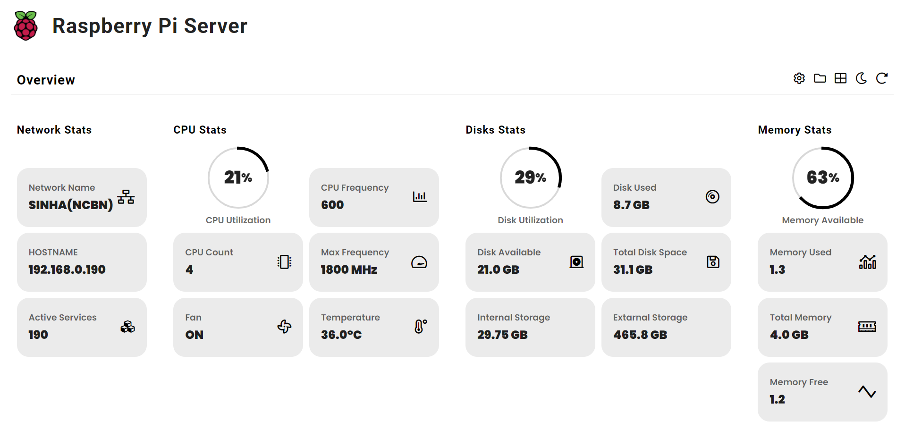

# TheCabinProject

###  RaspberryPi Server dashboard


## Requirements
1. Raspberry Pi
2. Os installed
3. python
4. python3-pip

## installation

```
pip3 install -r requirements.txt
```

## Run

```
python3 manage.py runserver 0.0.0.0:8000
```

In case you want to run the app from port 80, run the below comand.
As port 80 requires sudo permission. This method is insecure. Use this if you know what you are doing.

```
sudo -E python3 manage.py runserver 0.0.0.0:80
```
